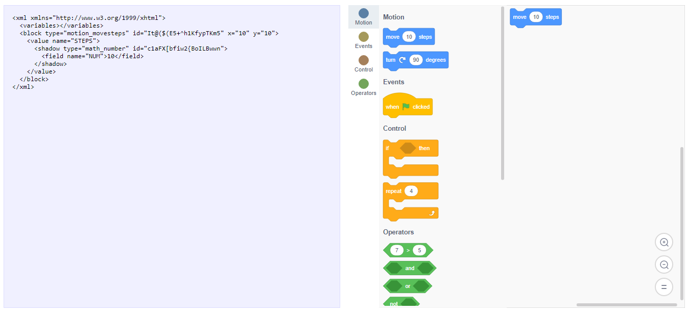

# Scratch Get Started
This is a simple example of how to start using [Scratch Blocks](https://github.com/LLK/scratch-blocks) in web a application. To learn more about it, checkout Scratch Blocks [documentation](https://github.com/LLK/scratch-blocks/wiki).

## About Blockly
[Blockly](https://developers.google.com/blockly) is a client-side library for the programming language JavaScript for creating block-based visual programming languages and editors. A project of Google, it is free and open-source software released under the Apache License 2.0. It typically runs in a web browser, and visually resembles the language Scratch. [Wikipedia](https://en.wikipedia.org/wiki/Blockly)

## Live demo

A live demo can be found at https://rafaeltmbr.github.io/scratch-get-started

